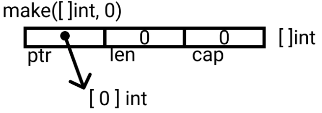

# make(T)

make(T) returns an initialized value of type T.
It applies only to the 3 built-in reference types: 
 - slices
 - maps and 
 - channels.

 

 ```go

p := make([]int, 0)
our slice is initialized, but here points to an empty array.

Both these statements arent very useful, the following is:

var v []int = make([]int, 10, 50)
// Or
v := make([]int, 10, 50)

 ```

 > Note: For slices, maps and channels: use make

make(T): it returns an initialized value of type T, It allocates and initializes the memory. Its used for slices, map and channels.