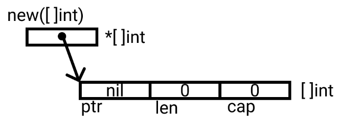

# new(T)
new(T) allocates uninitialized zeroed memory of the given type T and returns a pointer to that memory so that it is ready to use. 
Zeroed out just means that the allocated memory will have zero value of given type. 

Zero values of some go types are -
- int - 0
- bool - false
- float - 0
- string - ""
- struct - Zero value of each member

So, new(T) allocates zeroed storage for a new item of type T and returns its address, a value of type *T: it returns a pointer to a newly allocated zero value of type T, ready for use; it applies to value types like arrays and structs; it is equivalent to &T{ }



```go 

var p *[]int = new([]int)
or
// *p == nil; with len and cap 0
p := new([]int)

```

> Note: For arrays, structs and all value types: use new

